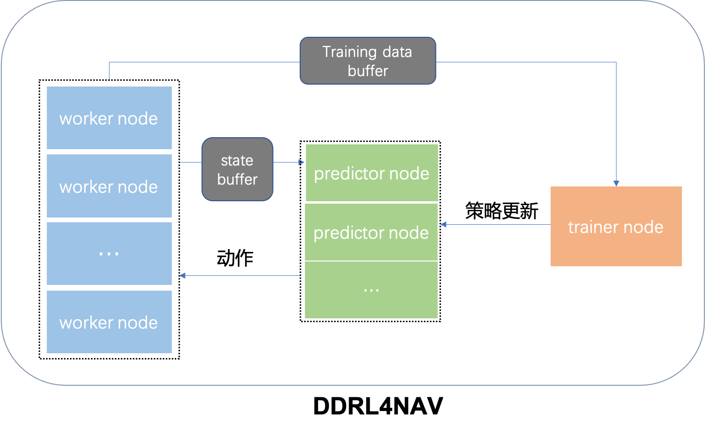

# Distributed DRL Frame For Robot Navigation

### Introduction

We reproduce a light RL training framework from [OpenAi Five](https://arxiv.org/abs/1912.06680). As seen in the following, the structure of our framework is totally the same as the paper shown. 3 key ingredients in the RL training process, Forward Module, Backward Module, and Env Module are separated.




### ENVIRONMENT SETTING

recommend os : centos | ubuntu16.04+

initialize your working directory in the beginning

```
chsh -s /bin/bash    # make sure you are in a bash-based terminal
sudo mkdir -p  /home/${USER}/DDRL4NAV
```

#### Redis

**if you have not installed redis-6.x yet,  please type the following command in your terminal** 

```
wget https://download.redis.io/releases/redis-6.2.6.tar.gz
sudo tar -xzvf redis/redis-6.2.6.tar.gz -C /usr/local/
sudo ln -s /usr/local/redis-6.2.6/src/redis-server /usr/bin/redis-server
sudo apt install redis-tools
```

#### Python3.8
make sure your python version >= 3.8. (ubuntu20.04 bring it already)


**third**: create venv

```
cd /home/${USER}/DDRL4NAV
pip3 install --user virtualenv
python3.8 -m virtualenv venv38

```

**forth**: source venv

```
source venv38/bin/activate
pip install -r requirements.txt
# then install pytorch: 
# see https://pytorch.org/get-started/locally/
# pip+cenos+cuda11.3:
pip3 install torch==1.10.2+cu113 torchvision==0.11.3+cu113 torchaudio==0.10.2+cu113 -f https://download.pytorch.org/whl/cu113/torch_stable.html
```

if you see (venv38)  in the head of your terminal , it means installed venv successfully!
```py
python
>>>import torch
>>>torch.cuda.is_available()
True
```
Notion: if you see False in your python console, just fit in pytorch version with your cuda .[Torch Version](https://pytorch.org/get-started/previous-versions)

now , the whole project dir tree like this:

```sh
-DDRL4NAV
​    -venv38
```

### Quick Start

supposed you are in /home/${USER}/DDRL4NAV dir

```
git clone git@github.com:DRL-Navigation/DDRL4NAV.git --recurse-submodules
```

now , the whole project dir tree like this:

```sh
-DDRL4NAV
​    -DDRL4NAV
​         -USTC_lab
​         -sh
​         -requirements.txt
​         -README.md
​    -venv38
```

now, let's try to train one classical atari game - Pong in your local machine

If you want to run robot navigation, you should also look [nav_env guide](https://github.com/DRL-Navigation/img_env) to run ros node.

**Notion: make sure to check USER in sh/config.sh**

```
cd /home/${USER}/DDRL4NAV/DDRL4NAV/sh
bash start_redis.sh
bash start.sh 
```

open tensorboard page :

```
bash tfboard.sh 
```

stop training

```
# warmly stop
bash stop.sh
# or you can just kill them
ps -ef|grep main.py|grep -v grep|awk '{print $2}'|xargs kill -9
```
### Connection between Env and Net
For training a neural network, you have to pick some kinds of states which observed by your env.
In addition, you have to define encoding network to encode states, and put the encoded states to AC,
Notice that `LAST_INPUT_DIM dim` in `config_nn.py`  means the dim of encoded states which will flow into
Actor and Critic later.


### Distributed Training Start
Make a Jump Server first.

**first**: connect to [Jump Server](https://zh.wikipedia.org/wiki/%E8%B7%B3%E6%9D%BF%E6%9C%BA)

```

```

**second**:  update repo

you should have modify personal branch **in your working machine**

```
git clone git@github.com:DRL-Navigation/DDRL4NAV.git --recurse-submodules
git checkout -b XXX

deploy config/config.sh

modify sh/machines/all.sh

modify sh/envs/XX.sh  # XX.sh setting in sh/config.sh

git push origin XXX:XXX
```

**In Jump Server**

first time 

```
USER=qiuqc # Notion: input your name here
mkdir -p /home/drl/{USER}/DDRL4NAV; cd /home/drl/${USER}/DDRL4NAV
git clone -b ${USER} git@git.ustc.edu.cn:drl_navigation/DDRL4NAV.git
```

then execute pull.sh to pull latest code in workers

```
cd /home/drl/${USER}/DDRL4NAV/DDRL4NAV/sh
bash pull.sh
```

**third**: start

```
cd /home/drl/${USER}/DDRL4NAV/DDRL4NAV/sh
bash start_redis.sh
bash start.sh config/config.sh remote
```

finally, open tensorboard then stop training if necessary

```
bash tfboard.sh remote
bash stop.sh remote
```
Jump Server file tree
```sh
-home
  -drl
    -UserA
      -DDRL4NAV
        -DDRL4NAV
          -output
    -UserB
      -DDRL4NAV
        -DDRL4NAV
          -output
```

### [Jump Server](https://zh.wikipedia.org/wiki/%E8%B7%B3%E6%9D%BF%E6%9C%BA)/跳板机

- if you want to train in a distributed way, you should always connect to Jump Server before doing anything.

- you should **git push** your personal branch before executing **bash pull.sh remote** in Jump Server

  

### Supplement

- Supports navigation tasks in different machines running in different environments, while using the same network for training. Note that currently only supports n processes running with same environment in one machine(worker). If necessary, this function can also be optimized into a machine with n processes running in n environments.


### Other
- about git submodule:  [Git中submodule的使用](https://zhuanlan.zhihu.com/p/87053283)
